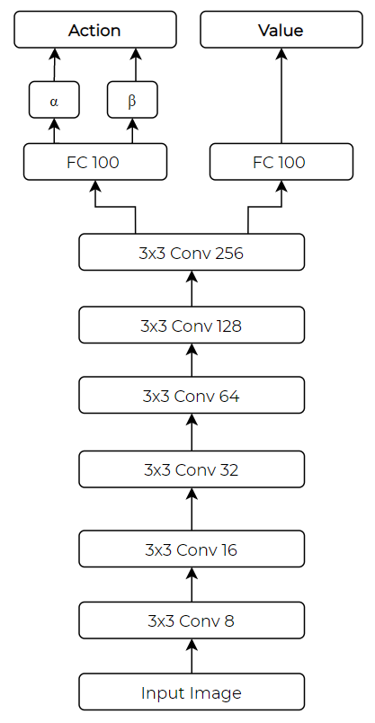
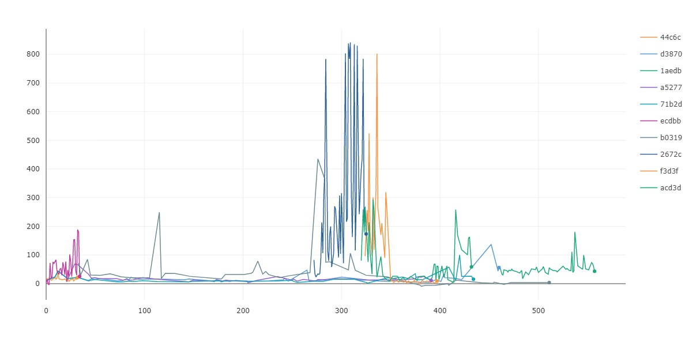

# CarRacingv0 with PPO 

There are 2 branches on this repository:
- `distances` : Converts the pixel space into a distance space for reduction in the size of the NN.
- `main`: Applies simple preprocessing on the pixel space before feeding it into the NN.


This repository is made such that the neural network and the methods can be modified very easily by just changing the configurations in the `config.py` file. It uses the `CometML` interface in order to track learning and different experiments.


## Demo


## Neural network for `main`



For the distances model, the neural network used is a simple feedforward network with a very low number of neurons that outputs the 3 required commands.

## Training


### Preprocessing

- Take 96x96 image, remove the base where the scores are shown
- Project 5 lasers from the top of the car, see where they meet the roads, and get the distances.
- Stack previous n distances of 5, and feed into a FCN, A2C network with PPO.
    - Hidden layer size is 128


### Notes

- Reasonable results, albeit with a lot of jerky steering.

- Best result so far was on following:
    - Train by letting the network optimize speed, steering and braking for initial bit.
    - Later on, switch off the throttle, and set to constant. This allowed for good convergence.

- Modifying parameters during training helps fine tune.
    - Threshold for greenery death can be decayed
    - Penalty for jerky steering should be introduced later into training
    - Clipping parameter can be decayed.


- A memory leak problem with the OpenAI Gym was resolved by following these steps:

> https://github.com/openai/gym/blob/38a1f630dc9815a567aaf299ae5844c8f8b9a6fa/gym/envs/box2d/car_racing.py#L527
> 
> There is memory leaking in car_racing.py code.
> 
> pyglet.graphics.vertex_list() function makes the memory almost double,
> 
> And it can be fixed with `vl.delete()` under this line
> https://github.com/openai/gym/blob/38a1f630dc9815a567aaf299ae5844c8f8b9a6fa/gym/envs/box2d/car_racing.py#L530


- Another bug with rotating camera fixed:
Commment out these lines around line 422
```python
vel = self.car.hull.linearVelocity
if np.linalg.norm(vel) > 0.5:
    angle = math.atan2(vel[0], vel[1])
```